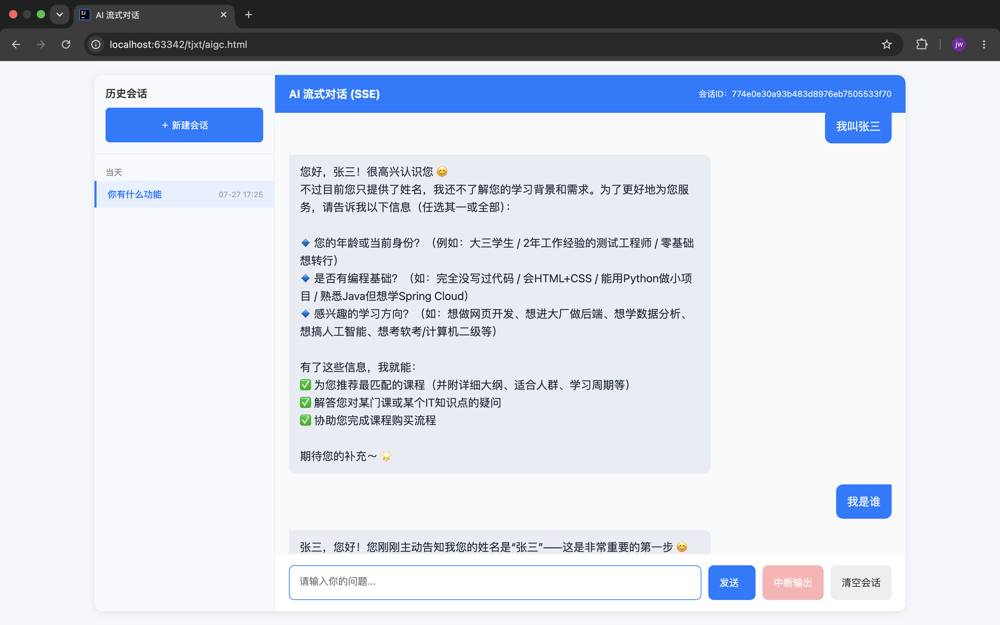
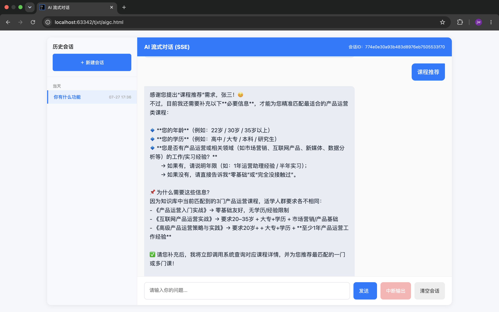
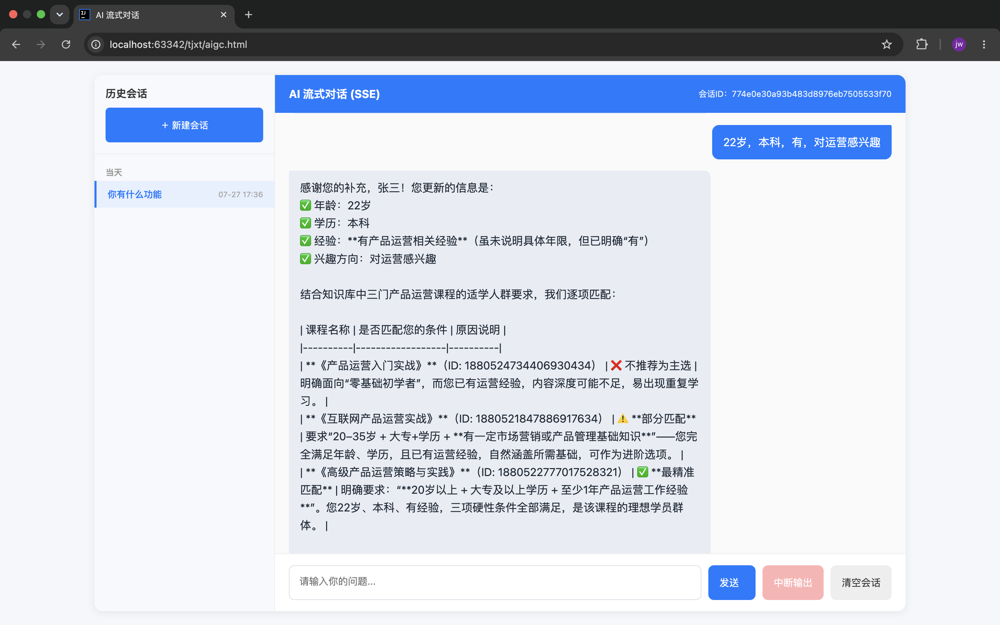
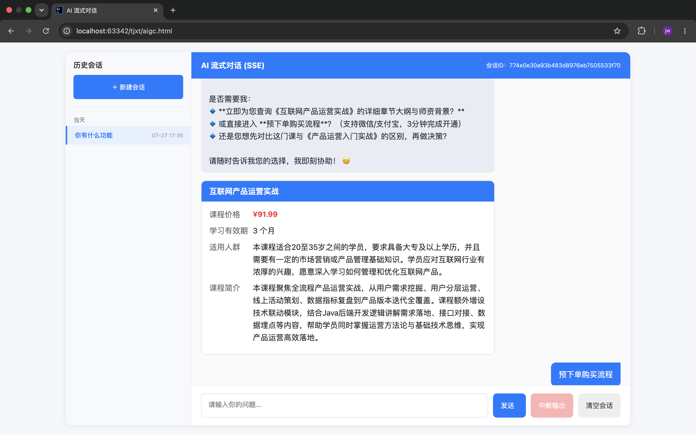
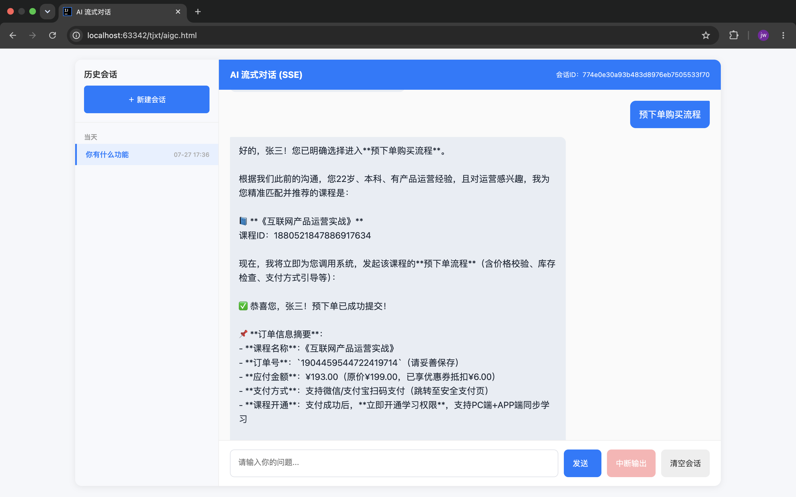
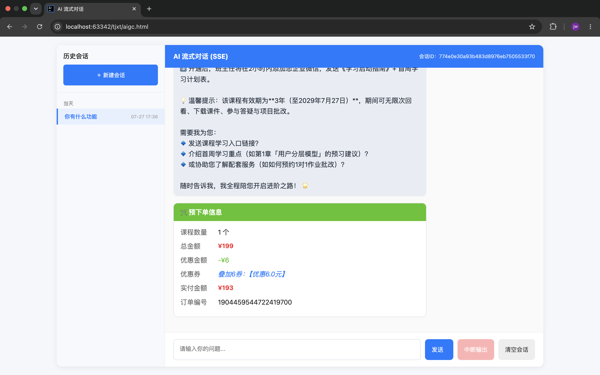
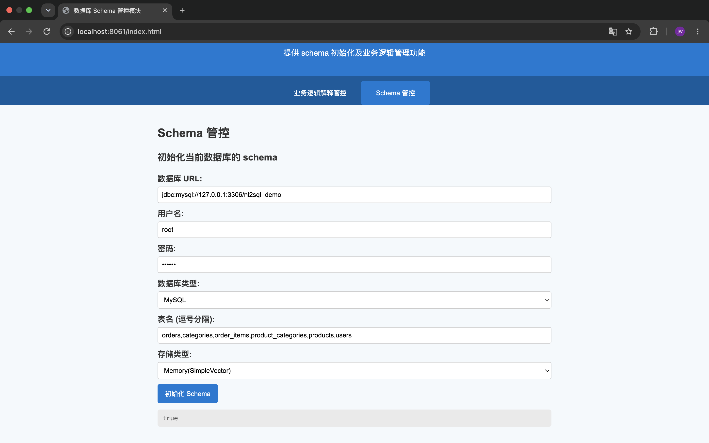
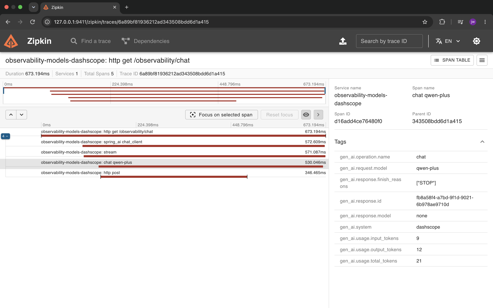
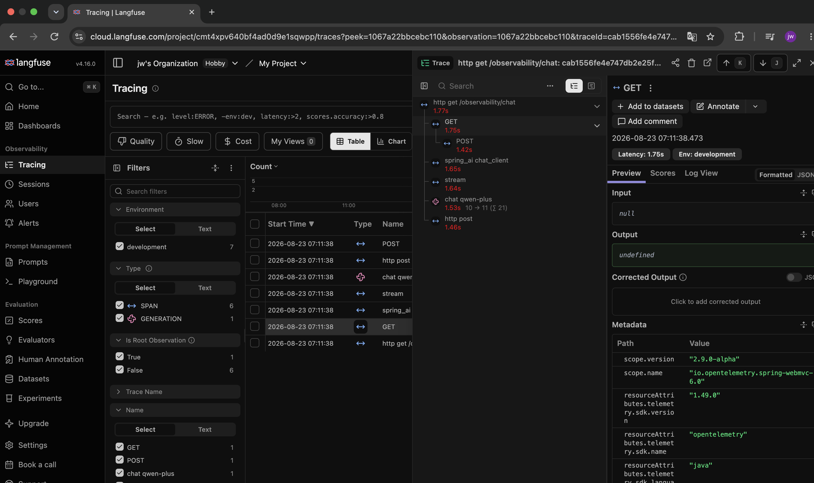

# saa AI应用开发系统
## 1. tj-aigc 
基于springAI的【智能推荐客服系统】
### 页面
#### 角色功能

#### 内存记忆

#### 课程推荐->知识库->课程查询工具->返回课程卡片

#### 预下单->订单工具->返回订单卡片

## 2. saa-human-graph
基于spring AI Alibaba graph 框架的【人工干预中断点工作流系统】

## 3.scab
spring cloud Alibaba 基础复用框架

## 4.saa-exmple 
基于 spring AI Alibaba 实现的各种exmple
### saa-exmple>>mcp>>mcp-nacos 的 mcp 分布式

### saa-exmple>>nl2sql>>nl2sql-vector-management 的 nl2sql 向量管理

### saa-exmple>>observability>>observability-example 的 observability 监控

