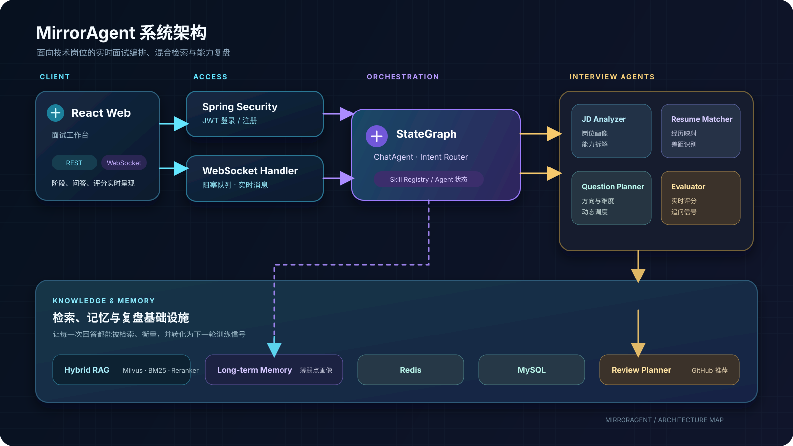

# saa AI应用开发系统
## 1. 实战tj-aigc 
基于springAI的【智能推荐客服系统】

### 模块功能总览
tj-aigc 是基于 **Spring AI 1.0 + 阿里通义千问(DashScope)** 的对话式 AI 智能教学助手模块，可查课程、预下单、做 RAG 知识问答。规划为 Spring Cloud Alibaba 在线教育微服务平台，仓库内当前实际落地本模块。

#### 核心能力
- **AI 对话**：通义千问大模型，流式 SSE 聊天，多轮上下文记忆
- **工具调用(Function Calling)**：`CourseTools.queryCourseById` 查课程详情；`OrderTools.prePlaceOrder` 预下单算优惠/实付
- **RAG 增强**：通过 Elasticsearch 向量检索提升回答质量
- **会话管理**：创建/查历史/删会话、热门示例推荐、按时间分组
- **系统提示词热更新**：Prompt 由 Nacos 动态管理，改配置即时生效无需重启

#### 代码结构
- Controller：`ChatController`(`POST /chat` SSE)、`SessionController`(会话增删查)、`EmbeddingController`(写向量)
- Service：`ChatService`(核心对话)、`ChatSessionService`、`ChatRecordService`
- 记忆存储(三后端可切换，`tj.ai.memory.type` 配置)：`RedisChatMemoryRepository`(Redis List)、`JdbcChatMemoryRepository`(MySQL chat_record 表)、`MongoDBChatMemoryRepository`(预留)，默认 100 条窗口上限
- 工具：`CourseTools`、`OrderTools`(`@Tool` 注解，结果经 `ToolResultHolder` 以 PARAM 事件推前端)
- 配置：`SystemPromptConfig`(Nacos 热更新)、`SpringAIConfig`、`AIProperties`、`SessionProperties`

#### SSE 交互流程
```
用户 ──POST /chat──→ ChatController → ChatService → ChatClient
                                      │
                    QuestionAnswerAdvisor(RAG) + MessageChatMemoryAdvisor(多轮记忆)
                                      │
                                   通义千问 LLM
                                      │
                              CourseTools / OrderTools
                                      │
                                 SSE 流式响应(DATA / PARAM / STOP)
```

#### 技术栈
Spring Boot 3.3 / Spring Cloud 2023 / Spring AI 1.0，Java 17，Nacos + Sentinel + Gateway，MySQL + MyBatis-Plus，Redis/Redisson/Caffeine，RabbitMQ，ES 7.12，Seata，XXL-Job(后几项为平台整体规划，仓库内未全部落地)

### 页面
#### 角色功能


#### 内存记忆


#### 课程推荐->知识库->课程查询工具->返回课程卡片


#### 预下单->订单工具->返回订单卡片


## 2. 实战MirrorAgent
基于 **Java 17 + Spring Boot 3.4 + Spring AI Alibaba** 的全栈 AI 模拟面试系统（前后端分离，位于 `saa-exmple/MirrorAgent`）。用户上传简历、输入目标岗位 JD，系统自动完成 JD 分析、简历匹配、智能出题、多轮技术面试与实时评分，面试结束后生成评估报告与个性化复习计划。工程内独立成完整项目，可单独运行。

### 模块功能总览
saa-exmple 下独立的前后端分离工程（Java + Web 两个子模块），底层大模型统一使用通义千问 DashScope，覆盖多 Agent 协作、RAG 多路召回、动态难度调节、Agent 记忆系统等大模型应用核心能力。

| 子模块 | 说明 |
|---|---|
| `MirrorAgent-java` | Spring Boot 后端（:9090，WebSocket 实时通信），含 Agent 编排 / RAG / 记忆 / Skill / 工具实现 |
| `MirrorAgent-web` | React 19 + Vite + TypeScript 前端（:5173），完整面试交互界面 |

#### 核心能力
- **多 Agent 协作**：7 个专职 Agent（聊天 + JD 分析 / 简历匹配 / 出题规划 / 面试官 / 评估 / 复习规划）经 Spring AI Alibaba StateGraph 编排为有向图，流程确定、各 Agent 可独立调优
- **RAG 多路召回**：Milvus 向量（text-embedding-v3，1024 维，COSINE）+ 内存 BM25 关键词双路并行检索，去重合并后交 LLM 全量重排；另实现 RRF(k=60) 融合器与 Recall@K / MRR 离线评估
- **动态难度调节**：出题阶段预生成按难度分档的候选题池，面试按 basic → experience → design 三阶段自适应取题，连续答对升一档、连续答错降一档
- **Agent 记忆系统**：短期对话记忆（20 条滑窗）+ 长期用户画像与薄弱点追踪（得分 <60 记录 / ≥80 移除 / 30 天淘汰），Redis 缓存热数据 + MySQL 持久化，Cache-Aside 管理
- **Skill 技能系统**：4 个内置 Skill（快速测验 / 概念教学 / 项目亮点 / 技术对比），经 SkillRegistry 注册中心按优先级匹配，可插拔扩展
- **工具集成**：GitHub 项目搜索（复习规划 Agent 的 ReactAgent 自主调用，推荐学习资源）+ 网页抓取工具（JD 链接基础抓取）
- **WebSocket 实时通信**：面试编排在独立线程池中执行，阻塞队列 + 回调实现「人在环」逐题问答，阶段进展实时推送前端

#### 技术栈
Java 17 / Spring Boot 3.4.1 / Spring AI Alibaba 1.1.2.0，通义千问 DashScope（qwen-plus，可换 qwen-max）、text-embedding-v3，Milvus 2.4、Redis 7、MySQL 8、Spring Security + JWT；前端 React 19 + Vite + TS + Tailwind 4 + Zustand；Docker Compose 一键启动基础设施（Milvus + Redis + MySQL），Makefile 封装常用命令

### 快速开始
```bash
cd saa-exmple/MirrorAgent/MirrorAgent-java
cp .env.example .env        # 只需填入 DASHSCOPE_API_KEY
make infra-up               # 启动 Milvus + Redis + MySQL（共 5 个容器）
make run                    # 启动后端 :9090
cd ../MirrorAgent-web
npm install && npm run dev  # 启动前端 :5173
```

### 架构图



## 3. saa-exmple 
基于 spring AI Alibaba 实现的各种exmple

### 模块功能总览
saa-exmple 是基于 **Spring AI Alibaba + Spring Boot 3** 的多模块示例集合，覆盖大模型对话、Agent、RAG、AI 工作流(Graph)、MCP、多模态、语音、图像、NL2SQL、可观测性等场景。

#### 1. 基础入门
- `helloworld`：最简对话示例，入门用
- `prompt`：系统提示词(system prompt)用法
- `structured`：结构化输出（按固定 schema 返回）
- `tool-calling`：工具/函数调用（Function Calling）
- `chat-memory`：对话记忆持久化（多轮记忆）
- `mem0`：用户偏好长期记忆

#### 2. 大模型接入与配置
- `chat`：集成多种大模型
  - `dashscope-chat`：联网搜索 / token 统计 / 图片分析
  - `qwq-chat`：深度思考内容输出
  - `azure-openai-chat` / `deepseek-chat` / `moonshot-chat` / `ollama-chat` / `openai-chat` / `vllm-chat` / `zhipuai-chat`
- `more-platform-and-model`：多平台多模型统一配置
- `bailian`：接入阿里云百炼智能体
- `nacos-prompt`：提示词动态变更（通过 Nacos 运行时改提示词）

#### 3. 多模态 / 多媒体
- `multi-model`：多模态模型
  - `dashscope-multi-model`：图 / 视 / 音
  - `openai-dashscope-multi-model` / `ark-multi-model`
- `audio`：语音文本转换（`dashscope-audio` 实时转录）
- `image`：文生图（`dashscope-image` / `openai-image`）

#### 4. Agent 智能体
- `agent`：智能航班预订助手 `flight-booking`（对话式订票）

#### 5. RAG 知识库与向量库
- `rag` + `vector-databases`：不同向量库做知识库
  - `rag-openai-dashscope-pgvector`：多格式文档录入
  - `rag-pgvector`：重排、向量元数据绑定 fileId、模板提示词
  - `module-rag`：用户问题优化 + 检索优化
  - `rag-etl-pipeline`：RAG 全流程
  - `rag-milvus` / `rag-elasticsearch` / `bailian-rag-knowledge` / `bailian-agent`
  - `vector-databases`：neo4j / redis / oceanbase 等向量库集合

#### 6. AI 工作流 Graph（StateGraph）
- `chatflow`：对话流 demo
- `human-node`：人工反馈中断（expander → human_feedback → translate 条件边）
- `dynamic-interrupt-human-node`：动态中断/恢复（订单审批、敏感操作两个场景）
- `stream-node`：流式输出（SSE）
- `parallel-node` / `parallel-stream-node`：并行节点 / 并行 + 流式
- `react`：ReAct 模式（带天气工具）
- `reflection`：反思节点
- `mcp-node`：工作流内调用 MCP 工具（命名规则 客户端_服务端_工具）
- `multiagent-openmanus`：多智能体协作
- `big-tool`：全自动工具调用（工具意图分析 → 调用 → 计算）
- `usecase-field-classifier`：字段敏感词检测 + 分类
- `workflow-review-classifier` / `workflow-writing-assistant`：评审分类 / 写作助手（线性链式图）
- `product-analysis-graph`：产品分析图（含状态序列化）
- `graph-observability-langfuse`：并行 + 嵌套子图 + Langfuse 图运行监控

#### 7. MCP（Model Context Protocol）
- `mcp-auth`：鉴权
- `mcp-build` / `mcp-config`：构建与配置
- `mcp-manual`：手写 MCP（含 sqlite 示例）
- `mcp-nacos`：基于 Nacos 的 MCP 分布式
- `mcp-starter`：快速启动 stdio server

#### 8. 自然语言转 SQL
- `nl2sql-chat`：对话式 NL2SQL
- `nl2sql-mcp` / `nl2sql-vector-management`：向量管理

#### 9. 可观测性
- `observability-langfuse`：Langfuse 监控
- `observability-arms`：阿里云 ARMS
- `observability-example` / `observationhandler`：观测示例

### 运行效果
#### saa-exmple>>mcp>>mcp-nacos 的 mcp 分布式


#### saa-exmple>>nl2sql>>nl2sql-vector-management 的 nl2sql 向量管理


#### saa-exmple>>observability>>observability-example 的 observability 监控


## 4. scab
spring cloud Alibaba 基础复用框架

### 模块功能总览
scab 是 **Spring Cloud Alibaba** 微服务基础复用框架，面向教育电商类业务，提供统一网关、认证授权、跨服务调用契约、通用组件与搜索能力。

#### 模块清单
| 模块 | 类型 | 核心功能 |
|---|---|---|
| `sc-common` | 基础公共模块 | 统一响应体 `R<T>`、异常体系、通用工具类、MyBatisPlus 分页/自动填充、Redisson 分布式锁、RabbitMQ 封装、Swagger/knife4j、xxl-job 自动配置，被所有模块依赖 |
| `sc-api` | 服务调用契约层 | OpenFeign 跨服务客户端：`AuthClient`(查角色)、`UserClient`(查用户/登录换取详情)，含 DTO、Sentinel 降级、Caffeine 缓存 |
| `sc-auth` | 认证授权聚合模块 | 含 4 个子模块：`sc-auth-common`(JWT/权限常量)、`sc-auth-gateway-sdk`(网关验签 + 接口权限校验)、`sc-auth-resource-sdk`(下游还原登录态到 UserContext)、`sc-auth-service`(登录/刷新签发 JWT、权限表刷入 Redis) |
| `sc-gateway` | 网关服务 | 统一入口：路由转发(lb:// + StripPrefix)、链路标识 requestId、JWT 鉴权 + 接口权限校验、WebFlux 全局异常、CORS |
| `sc-search` | 搜索服务 | ES 课程搜索(关键词/分类/筛选/排序/高亮) + 个性化推荐，通过 MQ 监听课程上/下架、过期事件同步索引 |

#### 核心数据链路
1. **登录发 token**：前端 → 网关 `/accounts/login` → auth-service → Feign `UserClient` 查用户详情 → 签发 access/refresh token
2. **请求鉴权**：网关 `RequestIdRelayFilter` 生成 requestId → `AccountAuthFilter` 白名单放行 / RSA 验签 / 注入 `user-info`、`token-info` 头 / 按 `method:path` 匹配权限表校验角色(无权限 403) → 转发下游
3. **权限数据流**：auth-service 启动或权限变更 → 从 DB 组装 `PrivilegeRoleDTO` → 写 Redis `auth:privileges` + version；网关每 20s 检查 version 变化并重载本地内存
4. **下游身份还原**：网关带 `user-info` 头 → 下游 `UserInfoInterceptor` 写 `UserContext` → `LoginAuthInterceptor` 校验；Feign 调用间由 `FeignRelayUserInterceptor` 透传 userId
5. **搜索链路**：业务服务发 MQ 事件 → sc-search 监听 → 同步/删除 ES 索引；查询走网关 `/ss/**` → ES 返回 CourseVO


