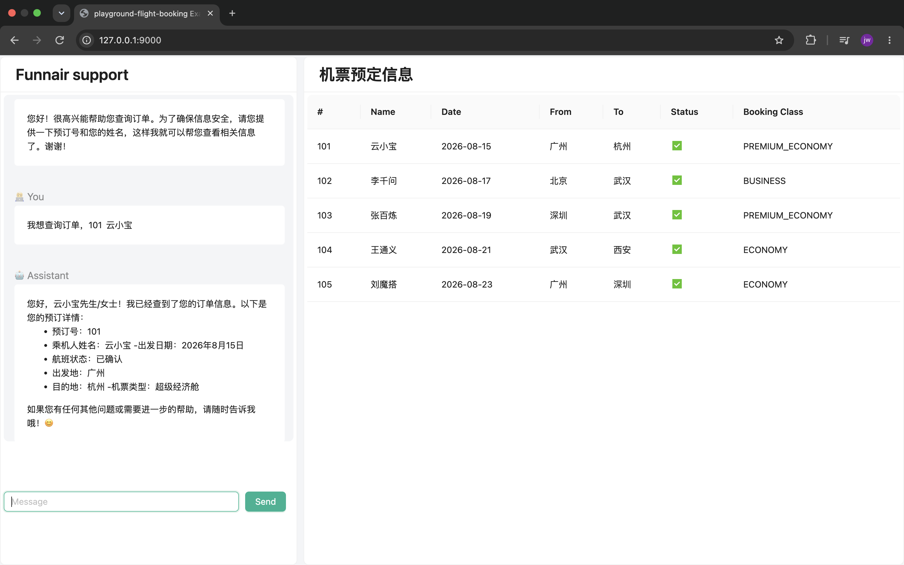
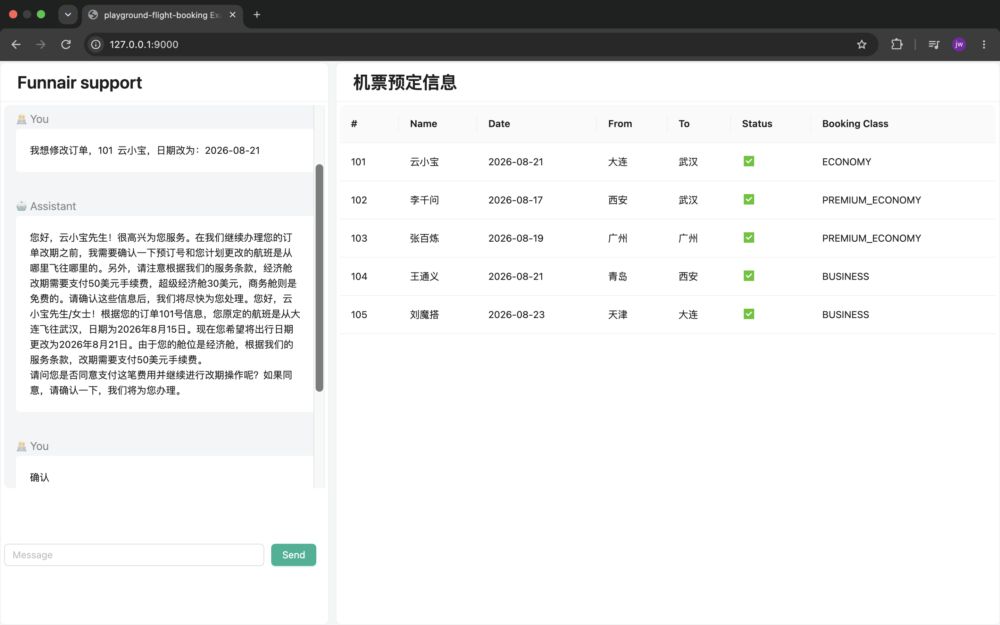
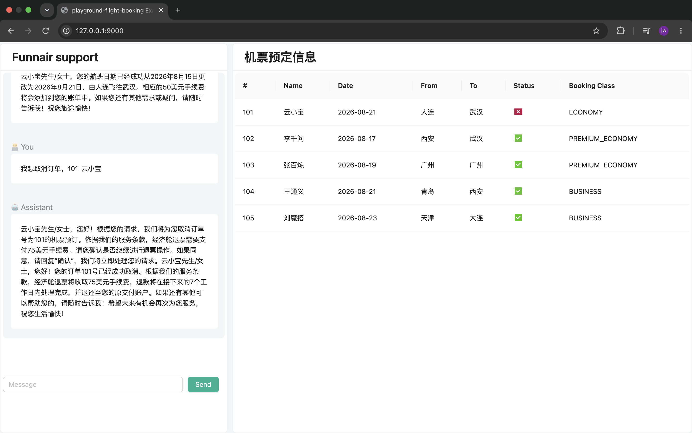
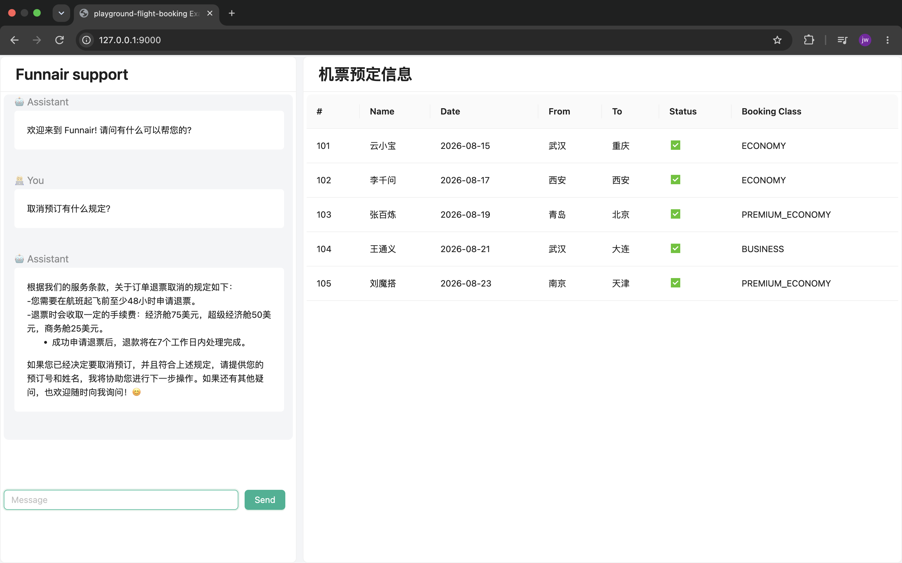

# 智能航空预订助手
## 启动，访问页面：http://127.0.0.1:9000
### 场景一：我想查询订单，101	云小宝

### 场景二：我想修改订单，101	云小宝，日期改为：2026-08-21

### 场景三：我想取消订单，101	云小宝

### 场景四：取消预订有什么规定？

## 知识检索 （RAG via VectorStore）
基于内存，项目启动，把目录的rag/terms-of-service.txt 按照token 长度切分文档向量化入库
操作都依照服务条款进行

## 记忆能力 （ChatMemory）
基于内存

## 函数调用 （Function Calling）

## 自然语言交互 （ChatClient）

