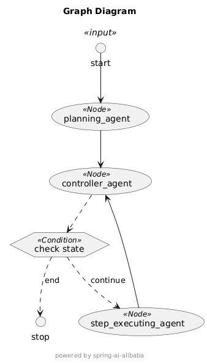

## 配置
1. 浏览器无法启动就调用，需要配置
IDEA → Run Configuration → VM options，填入镜像参数：
```
-Dselenium.manager.driverMirror=https://npmmirror.com/mirrors/chrome-for-testing-public/
```
2. 设置google 搜索key SERP_API_KEY
```
https://serpapi.com/
```

##
规划->协调->执行

## Multi-agent OpenManus 示例
以下是 OpenManus 实现的架构图：



在 OpenManus 示例中，我们实现了一个 multi-agent 系统。其中，有三个核心 agent 互相协作完成用户任务：

1. Planning Agent，负责任务规划
2. Supervisor Agent，负责监督 Executor Agent 完成规划的任务
3. Executor Agent，负责执行每一步任务

浏览器访问如下示例链接，查看运行效果：

* http://localhost:18080/manus/chat?query=帮我查询阿里巴巴近一周的股票信息
* 
