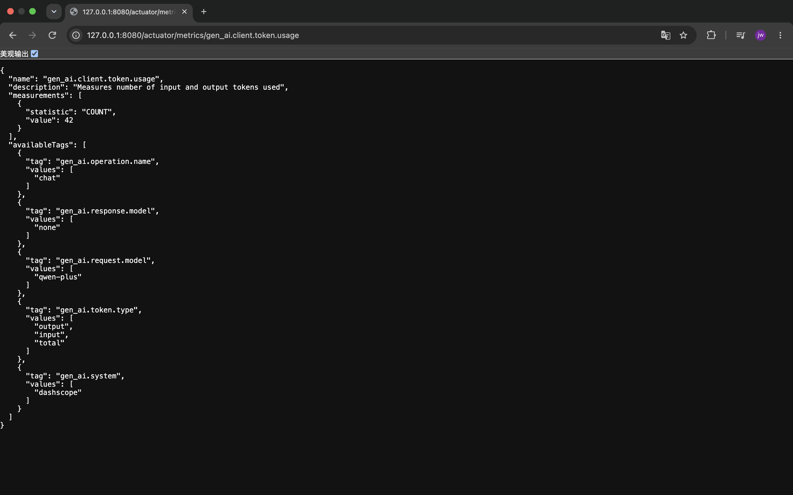

## 配置参数

| 参数名                 | 参数值                                      | 描述         |
|---------------------| ----------------------------------------- |------------|
| log-completion      | true          | 记录AI模型返回内容 |
| log-prompt          | true          | 记录AI模型提示内容 |
| include-err-logging | true          | 包含错误日志     |
| log-query-response  | true          | 记录查询响应内容   |
| include-content     | true          | 包含内容         |

## 功能介绍
### 日志记录功能
1. 记录提示词内容
2. 记录完成内容
3. 记录模型调用元数据（如模型名称、使用令牌数等）

### 指标收集功能
http://127.0.0.1:8080/actuator/metrics
- "gen_ai.client.operation",
- "gen_ai.client.operation.active",
- "gen_ai.client.token.usage",
1. AI 模型调用次数统计
2. AI 模型调用耗时统计
3. 令牌使用量监控
4. 错误率统计

### 分布式追踪功能
1. 每个调用生成唯一 traceId
2. 相关调用共享同一个 traceId
3. 形成完整的调用链
4. zipkin UI 可视化（查看调用链详细信息和耗时分布）

### 实现
1. 日志记录功能 — spring.ai.*.observations.*

配置位置 application.yml:5-40：

| 配置项 | 作用 |
| ---- | ---- |
| `spring.ai.dashscope.observations.log-prompt: true` | 记录发往 DashScope 的提示词内容（模型层） |
| `spring.ai.dashscope.observations.log-completion: true` | 记录模型返回的完成内容 |
| `spring.ai.chat.client.observations.log-prompt/log-completion` | ChatClient 层的提示词/完成日志 |
| `spring.ai.chat.client.observations.include-error-logging: true` | 失败调用也记录错误日志 |
| `spring.ai.vectorstore.observations.log-query-response: true` | 记录向量库查询与响应 |
| `spring.ai.tools.observations.include-content: true` | 观察数据中包含工具调用的内容 |

> **注意：**
> 1. `log‑prompt` / `log‑completion` 控制**完整报文日志打印**，属于payload内容，生产环境建议关闭，防止敏感信息泄露；
> 2. 模型元数据（模型名称、token用量、temperature等`gen_ai.*`标签）由Observation埋点自动采集写入Span标签，无需上述开关控制；
> 3. SSE流式(`.stream()`)场景下部分元数据、链路父子关系会存在缺失，调试优先使用同步`.call()`接口。

2. 指标收集功能 — actuator + Micrometer 自动指标

- 依赖：spring-boot-starter-actuator（pom.xml:24）
- 配置：management.endpoints.web.exposure.include: "*"（application.yml:52-54）暴露 /actuator/metrics
- 指标由 Spring AI 通过 ObservationRegistry → MeterRegistry 自动采集，无需手写代码，主要指标名：
    - ai.client.operation.duration — 调用次数、耗时、错误率（错误通过 error=true 的 tag 区分）
    - ai.client.operation.tokens.total / ai.client.operation.tokens.prompt / ai.client.operation.tokens.completion — 令牌用量

查看方式：
curl http://127.0.0.1:8080/actuator/metrics

3. 分布式追踪 — Brave + Zipkin

- 依赖（pom.xml:38-54）：
    - micrometer-tracing-bridge-brave — 负责生成/传播 traceId、管理 span
    - zipkin-reporter-brave — 把 span 上报到 Zipkin
- 配置（application.yml:59-65）：
    - management.tracing.sampling.probability: 1.0 — 100% 采样（每个请求都记录）
    - management.zipkin.tracing.endpoint: http://127.0.0.1:9411/api/v2/spans — span 上报地址
- Zipkin 服务：docker-compose/zipkin/docker-compose.yaml 起一个 openzipkin/zipkin 容器，UI 在 http://127.0.0.1:9411

机制：每个 HTTP 请求进入时 Brave 生成一个唯一 traceId；Spring AI 的 ai.client.operation span 与其共享同一 traceId，形成「HTTP 请求 → 模型调用」完整调用链，Zipkin UI 可查看各节点耗时分布。

## 指标收集功能实现

## 分布式追踪功能实现

