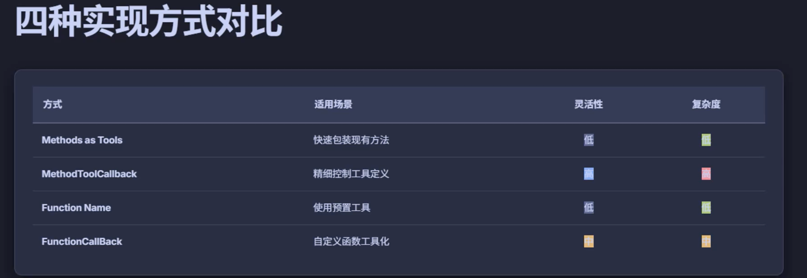

# 工具四种不同的调用方式

## 百度翻译工具
BaiduTranslateController
1. 直接使用toolnames()方法注册函数名
2. 函数需已在spring容器中注册
3. 最简洁的工具注册方式
4. 适用于框架的预置工具

## 百度地图工具
AddressController
1. 使用MethodToolCallBack.builder()构建工具回调
2. 手动定义ToolDefinition(名称 描述 输入模式)
3. 通过反射获取方法对象
4. 适用于精细控制工具调用的场景

## 时间服务工具
TimeController
1. @Tool 注解标注方法
2. ChatClient.tool()注册工具
3. 适用简单方法调用

## 天气服务工具
WeatherController
1. 使用functionToolCallback.builder()构建工具回调
2. 指定函数名称、函数对象，描述和输入类型
3. 适用于自定义函数的工具化

