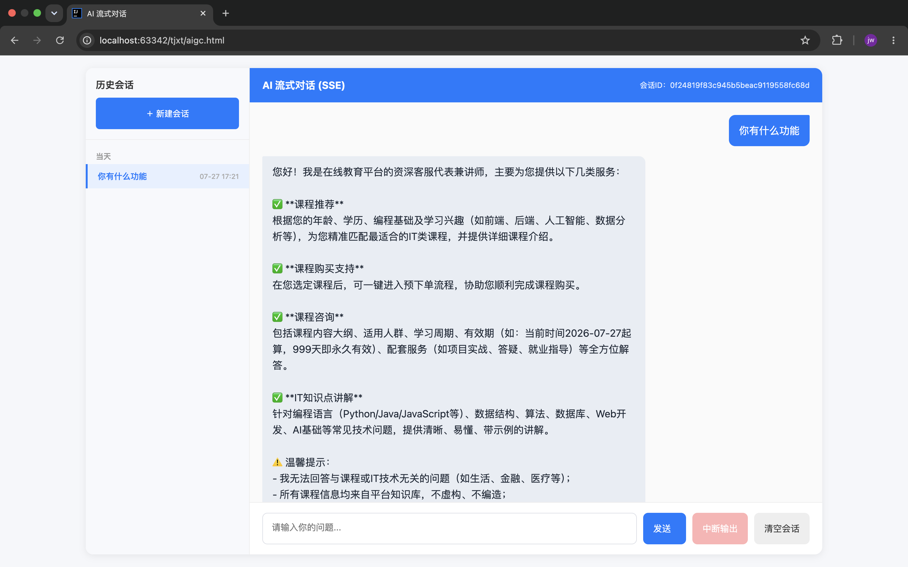

# DEMO微服务集成AIGC

这是一个基于 Spring Cloud Alibaba 微服务架构的在线教育平台，集成 Spring AI 构建了 AI 智能教学助手，提供课程学习、考试评测、订单交易、社区互动等完整的在线教育解决方案。

---

## 技术栈

| 类别 | 技术 |
|------|------|
| 核心框架 | Spring Boot 3.3, Spring Cloud 2023, Spring AI 1.0 |
| 语言 | Java 17 |
| 服务治理 | Nacos (注册中心 + 配置中心), Sentinel (熔断降级) |
| 网关 | Spring Cloud Gateway |
| 数据库 | MySQL, MyBatis-Plus |
| 缓存 | Redis, Redisson, Caffeine |
| 消息队列 | RabbitMQ |
| 搜索引擎 | Elasticsearch 7.12 |
| 分布式事务 | Seata |
| 任务调度 | XXL-Job |
| 对象存储 |阿里云 OSS, 腾讯云 COS/VOD |
| 第三方支付 |支付宝, 微信支付 |
| AI | 阿里通义千问 (DashScope), Spring AI |

---

## 模块架构

| 模块 | 说明 |
|------|------|
| `tj-aigc` | AI 智能教学助手 — 基于大语言模型的对话式 AI 助教 |
| `tj-gateway` | API 网关 — 统一入口、路由转发、认证过滤 |
| `tj-auth` | 认证授权中心 — 用户登录、JWT 令牌、资源/网关 SDK |
| `tj-user` | 用户服务 — 用户账户、个人信息管理 |
| `tj-course` | 课程服务 — 课程目录、分类、大纲、内容管理 |
| `tj-learning` | 学习服务 — 课程报名、学习进度、签到积分 |
| `tj-trade` | 交易服务 — 购物车、下单、订单管理 |
| `tj-pay` | 支付服务 — 支付宝/微信支付集成、对账 |
| `tj-promotion` | 营销服务 — 优惠券、折扣策略、促销活动 |
| `tj-exam` | 考试服务 — 试题管理、考试测评、自动评分 |
| `tj-search` | 搜索服务 — 基于 Elasticsearch 的课程全文检索 |
| `tj-media` | 媒体服务 — 文件上传、视频点播/处理 |
| `tj-message` | 消息服务 — 短信、邮件、站内通知 |
| `tj-remark` | 互动服务 — 点赞、评论、评价 |
| `tj-data` | 数据中心 — 统计分析、运营看板 |
| `tj-common` | 公共模块 — 基础工具、异常、通用配置、自动装配 |
| `tj-api` | Feign 接口层 — 跨服务调用接口与 DTO |

---

## AIGC 模块 — AI 智能教学助手

`tj-aigc` 是基于 Spring AI 1.0 + 阿里通义千问 (DashScope) 构建的对话式 AI 教学助手，支持自然语言交互、多轮对话、检索增强生成（RAG）和工具调用。

### 核心功能

| 功能 | 说明 |
|------|------|
| **AI 对话** | 基于通义千问大模型的流式 SSE 聊天，支持多轮上下文记忆 |
| **课程查询** | 通过函数调用查询课程详细信息（名称、价格、时长等） |
| **预下单** | 为用户预生成订单，计算优惠和实付金额 |
| **RAG 增强** | 通过 Elasticsearch 向量存储检索相关文档，增强回答质量 |
| **会话管理** | 创建会话、历史记录查看、删除，支持热门示例推荐 |
| **系统提示词热更新** | 系统 Prompt 由 Nacos 动态管理，修改即时生效无需重启 |

### 交互流程

```
用户 ──POST /chat──→ ChatController ──→ ChatService ──→ ChatClient (Spring AI)
                                                          │
                                              ┌───────────┴───────────┐
                                              │                       │
                                         QuestionAnswerAdvisor    MessageChatMemoryAdvisor
                                         (RAG / 向量检索)          (多轮对话记忆)
                                              │                       │
                                              └───────────┬───────────┘
                                                          │
                                                  通义千问 LLM
                                                   (DashScope)
                                                          │
                                              ┌───────────┴───────────┐
                                              │                       │
                                          CourseTools           OrderTools
                                         (课程查询工具)         (预下单工具)
                                              │                       │
                                              └───────────┬───────────┘
                                                          │
                                                    SSE 流式响应
                                               (DATA / PARAM / STOP)
```

### API 接口

#### 聊天

| 方法 | 路径 | 说明 |
|------|------|------|
| `POST` | `/chat` | AI 对话，返回 SSE 流式响应（`text/event-stream`） |
| `POST` | `/chat/stop` | 停止正在生成的 AI 回复 |

SSE 事件类型：

- `DATA` (1001) — AI 回复文本片段
- `PARAM` (1003) — 工具调用产生的结构化数据（课程信息、订单信息）
- `STOP` (1002) — 回复结束

#### 会话管理

| 方法 | 路径 | 说明 |
|------|------|------|
| `POST` | `/session` | 创建新会话，随机选取会话示例 |
| `GET` | `/session/history` | 查询历史会话列表，按时间分组 |
| `GET` | `/session/hot` | 获取热门会话示例 |
| `GET` | `/session/{id}` | 查询指定会话的完整聊天记录 |
| `DELETE` | `/session/history` | 删除指定会话 |

#### 向量存储

| 方法 | 路径 | 说明 |
|------|------|------|
| `POST` | `/embedding` | 写入 Embedding 向量到向量存储 |

### 聊天记忆架构

支持三种存储后端，通过 `tj.ai.memory.type` 配置切换：

| 后端 | 配置值 | 说明 |
|------|--------|------|
| **Redis** | `Redis` | 基于 Redis List，以 `CHAT:{conversationId}` 为 Key |
| **MySQL** | `MYSQL` | 基于 `chat_record` 表持久化 |
| **MongoDB** | `MongoDB` | 已预留实现，当前注释 |

内存窗口上限可配置（默认 100 条消息），超出后自动丢弃最早消息。

### 函数调用 (Tools)

AI 模型可通过 `@Tool` 注解的方法直接与后端交互：

| 工具 | 方法 | 说明 |
|------|------|------|
| `CourseTools` | `queryCourseById(courseId)` | 按 ID 查询课程详情 |
| `OrderTools` | `prePlaceOrder(ids)` | 预下单，计算总价、优惠和实付金额 |

工具执行的结构化结果通过 `PARAM` SSE 事件推送到前端，用于渲染数据卡片，无需额外 API 调用。

### 配置说明

```
# AI 服务
spring.ai.chat.client.enabled=true
spring.ai.dashscope.api-key=${DASHSCOPE_API_KEY}

# 系统提示词 (Nacos 动态配置)
tj.ai.prompt.system.chat.dataId=system-chat-prompt
tj.ai.prompt.system.chat.group=AIGC_GROUP

# 会话配置
tj.ai.session.title=学堂AI助手
tj.ai.session.describe=我是学堂的AI助教，可以帮你查询课程、下单购买

# 记忆存储
tj.ai.memory.type=Redis
tj.ai.memory.max=100
```

---

## 快速启动

### 必备服务

| 服务 | 说明 |
|------|------|
| Nacos | 注册中心 + 配置中心 |
| MySQL | 业务数据库 |
| Redis | 缓存 + 聊天记忆存储 |
| RabbitMQ | 消息队列 |
| Elasticsearch | 搜索 + 向量存储（AIGC RAG 增强） |
| XXL-Job | 分布式任务调度 |

### 启动顺序

1. **Nacos** — 注册中心与配置中心
2. **tj-auth** — 认证授权中心
3. **tj-gateway** — API 网关
4. **tj-aigc** — AI 教学助手（必需）
5. **其他微服务** — 为 AIGC 提供工具支持（选填，目前工具使用模拟数据）

### 获取 Token

```json
POST /as/login
{
    "type": 1,
    "username": "jack",
    "cellPhone": "",
    "password": "123456",
    "rememberMe": false
}
```

### 前端

AIGC 模块的前端页面可直接打开 `tj-aigc/aigc.html` 或 `aigc.html` 文件使用。

---

## 开发环境

- JDK 17+
- Maven 3.8+
- IntelliJ IDEA (推荐安装 Lombok、MyBatisX 插件)
- Docker (可选，用于本地搭建 Nacos、MySQL、Redis 等)

## 页面
### 角色功能


### 内存记忆


### 课程推荐->知识库->课程查询工具->返回课程卡片


### 预下单->订单工具->返回订单卡片


